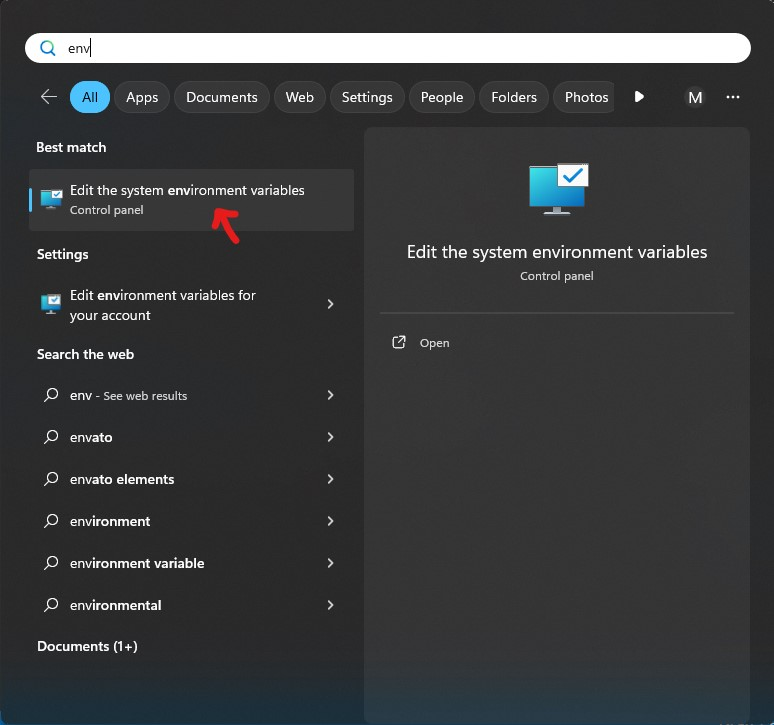
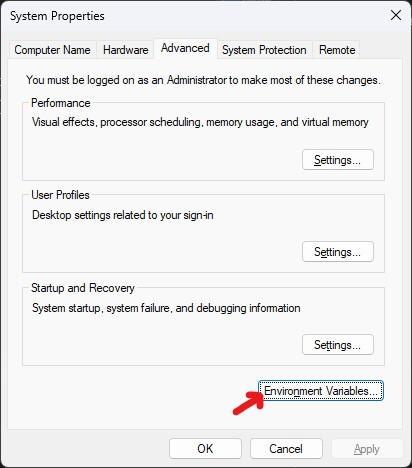
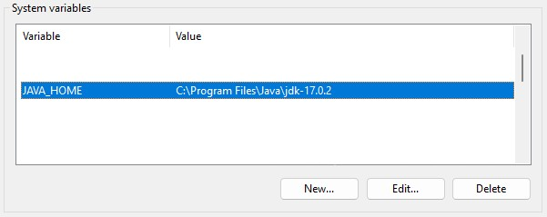
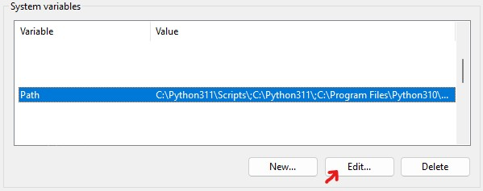
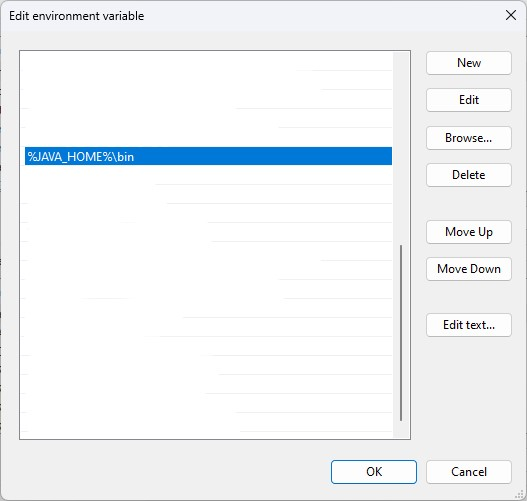

# Java Standardization ☕☕☕
Sebuah dokumentasi bahasa pemrograman Java

| [A. Pendahuluan](#a-pendahuluan-) | [B. Instalasi JDK](#b-instalasi-jdk-) | [C. Get Started](#c-get-started-)
| :-------------------------- | :-------------------------------  | :------------------------------- |
| [Sejarah Singkat](#sejarah-singkat-) | [Windows](#windows-) | [Hello World](#1-hello-world-)
| [Kelebihan Java](#kelebihan-java-) | [Linux atau MacOs](#linux-atau-macos-) | [Java Variable](#2-java-variabel-)
| [Kekurangan Java](#kekurangan-java-) | | [Java Operators](#3-java-operators) |
| [JDK vs JRE](#jdk-vs-jre-) | | [Java Condition](#4-java-condition-) |

## A. Pendahuluan [^](#)
### Sejarah Singkat [^](#)
Java adalah bahasa pemrograman yang dapat dijalankan di berbagai komputer termasuk telepon genggam. Bahasa ini awalnya dibuat oleh James Gosling saat masih bergabung di Sun Microsystems, yang saat ini merupakan bagian dari Oracle dan dirilis tahun 1995. Java terlahir dari The Green Project, yang berjalan selama 18 bulan, dari awal tahun 1991 hingga musim panas 1992. Proyek ini dimotori oleh Patrick Naughton, Mike Sheridan, dan James Gosling, beserta sembilan pemrogram lainnya dari Sun Microsystems. Salah satu hasil proyek ini adalah maskot Duke yang dibuat oleh Joe Palrang. Awalnya, Proyek ini dikenal sebagai "Oak" dan ditujukan untuk perangkat elektronik konsumen, seperti mesin cuci, tetapi visinya berkembang menjadi lebih luas. Nama Oak, diambil dari pohon oak yang tumbuh di depan jendela ruangan kerja “bapak java”, James Gosling. Nama Oak ini tidak dipakai untuk versi release Java karena sebuah perangkat lunak sudah terdaftar dengan merek dagang tersebut, sehingga diambil nama penggantinya menjadi “Java”. Nama ini diambil dari kopi murni yang digiling langsung dari biji (kopi tubruk) kesukaan Gosling.

### Kelebihan Java [^](#)
1. ***Multiplatform***: Program Java dapat dijalankan di berbagai platform karena kode sumber Java dikompilasi menjadi bytecode yang dapat dijalankan di Mesin Virtual Java (JVM). Ini membuatnya sangat portabel dan dapat digunakan di berbagai sistem operasi.

2. ***Sintaksis yang Mudah Dipahami***: Sintaksis Java mirip dengan bahasa-bahasa pemrograman lainnya seperti C++ dan C#, sehingga mudah dipahami oleh banyak programmer.

3. ***Orientasi Objek***: Java adalah bahasa pemrograman berorientasi objek (OOP) yang memungkinkan pemodelan yang baik dari dunia nyata dan memudahkan pengembangan dan pemeliharaan kode.

4. ***Manajemen Memori Otomatis***: Java memiliki sistem pengelolaan memori otomatis yang mengelola alokasi dan penghapusan memori, menghindari banyak kesalahan yang terkait dengan memori, seperti kebocoran memori.

5. ***Keamanan***: Java dirancang dengan keamanan dalam pikiran. Itu memiliki mekanisme keamanan yang kuat, termasuk pemisahan kelas dan pustaka yang dapat diakses oleh kode sumber yang berbeda.

6. ***Kaya akan Ekosistem***: Java memiliki ekosistem yang kaya dengan berbagai pustaka dan framework yang mendukung pengembangan berbagai jenis aplikasi, termasuk aplikasi web, mobile, dan desktop.

7. ***Multithreading***: Java mendukung multithreading dengan mudah, yang memungkinkan pengembangan aplikasi yang dapat menjalankan beberapa tugas secara bersamaan, meningkatkan kinerja.

8. ***Ketahanan***: Program Java cenderung lebih tahan terhadap kesalahan dan kegagalan karena manajemen memori yang baik dan mekanisme penanganan pengecualian.

9. ***Dukungan Komunitas***: Java memiliki komunitas pengembang yang besar dan aktif, sehingga Anda dapat dengan mudah menemukan dukungan, dokumentasi, dan solusi untuk masalah yang mungkin Anda hadapi.

10. ***Perusahaan***: Java sering digunakan dalam pengembangan perangkat lunak bisnis dan aplikasi perusahaan, sehingga memiliki dukungan kuat dari banyak perusahaan besar.

11. ***Performa yang Cukup Baik***: Meskipun Java tidak selalu secepat bahasa pemrograman lain seperti C++ atau Rust, performanya cukup baik dan terus meningkat dengan setiap versi baru.

12. ***Pembaruan Rutin***: Java secara teratur diperbarui oleh Oracle dan komunitas terbuka, yang memastikan adanya peningkatan terus-menerus dalam bahasa dan platformnya.

13. ***Kompatibilitas Mundur***: Java biasanya mendukung kompatibilitas mundur, yang berarti kode Java lama cenderung masih berjalan pada versi Java yang lebih baru dengan sedikit atau tanpa perubahan.

### Kekurangan Java [^](#)
1. ***Konsumsi Memori:*** Java membutuhkan memori yang cukup tinggi. Bahasa pemrograman Java menawarkan banyak fitur yang luar biasa, mulai dari kemudahan dalam menyusun skrip, hingga fitur berorientasi objek, yang menjadi salah satu ciri khas dari bahasa pemrograman Java. Namun, hal ini juga berdampak pada penggunaan memori yang cukup besar, sehingga dapat memperlambat kinerja aplikasi atau program yang dibuat dengan Java

2. ***Mudah Didekompilasi:*** Kode sumber Java yang telah dikompilasi menjadi bytecode dapat dengan mudah didekompilasi kembali menjadi kode sumber asli dengan menggunakan alat decompiler. Hal ini dapat menimbulkan masalah keamanan dan privasi bagi pengembang aplikasi atau program yang ingin melindungi kode sumber mereka dari orang lain.

3. ***GUI Kurang Menarik:*** Java memiliki Graphical User Interface (GUI) yang kurang menarik. Dibandingkan dengan bahasa pemrograman lain seperti C# atau Visual Basic, Java memiliki GUI yang kurang menarik dan variatif. Hal ini dapat mengurangi minat pengguna untuk menggunakan aplikasi atau program yang dibuat dengan Java.

4. ***Kode yang Panjang***: Beberapa pengembang menganggap kode Java lebih panjang daripada bahasa pemrograman lain seperti Python. Hal ini bisa mengakibatkan penulisan kode yang lebih lambat dan berisiko terhadap kesalahan.

### JDK vs JRE [^](#)
sederhananya `JDK (Java Development Kit)` merupakan tools untuk `mengembangkan` program java, sedangkan `JRE (Java Runtime Environment)` merupakan tools untuk `menjalankan` program java. Ketika menginstall JDK didalamnya sudah terdapat JRE, sehingga kita tidak perlu lagi untuk menginstal JRE


## B. Instalasi JDK [^](#)
Pada dokumentasi ini, kita akan mencoba meng-install menggunakan [OpenJDK](https://openjdk.java.net/) dikarenakan open source dan juga free.

Selain OpenJDK ada beberapa alternatif lain seperti:
- [OracleJDK](https://www.oracle.com/java/technologies/javase-downloads.html)
- [Amazon Corretto](https://aws.amazon.com/id/corretto/)
- [Zulu](https://www.azul.com/downloads/zulu-community/)


### Windows [^](#)
1. Install dan pilih versi java yang diinginkan pada laman https://jdk.java.net/archive/

2. Lalu ekstrak file pada lokasi yang kita inginkan

3. Atur environment variable
    - tekan tombol windows
    - cari 'env' maka nanti akan muncul seperti ini<br/>
    
    - Klik Environment Variables<br/>
    
    - Tambahkan environment variable baru dengan nama variable `JAVA_HOME`, dan nilai variable berupa lokasi direktori yang mengarah pada jdk yang kita install sebelumnya. Lokasi direktori adalah lokasi **sebelum `bin`** folder<br/>
    
    - Tambahkan lokasi folder jdk bin pada `Path` di system variable<br/>
    
    
4. Kemudian simpan dan pastikan berhasil dengan mencoba perintah 
    - `$ java --version`
    - kalau berhasil akan muncul detail versi java seperti 
        ```
        openjdk 17.0.2 2022-01-18
        OpenJDK Runtime Environment (build 17.0.2+8-86)
        OpenJDK 64-Bit Server VM (build 17.0.2+8-86, mixed mode, sharing)
        ```
        versi mungkin berbeda sesuai yang kita install sebelumnya
    - `$ javac --version`
    - kalau berhasil akan muncul detail versi java compiler seperti 
        ```
        javac 17.0.2
        ```

### Linux atau MacOs [^](#)
1. Install dan pilih versi java yang diinginkan pada laman https://jdk.java.net/archive/

2. Atur environment variable 
    - Tambahkan lokasi jdk **(sebelum direktori `bin`)** yang kita install kedalam environment dengan nama `JAVA_HOME`
    - Tambahkan lokasi jdk bin pada environment `PATH` 
    - Dua tahapan diatas bisa dilakukan dengan menambahkan baris berikut pada `.bashrc` atau `.profile` atau `.zshrc`
        ```sh
        export JAVA_HOME="/lokasi/ke/jdk/yang/kita/simpan"
        export PATH="$JAVA_HOME/bin:$PATH"
        ```

3. Pastikan dengan mencoba perintah 
    - `$ java --version`
    - kalau berhasil akan muncul detail versi java seperti 
        ```
        openjdk 17.0.2 2022-01-18
        OpenJDK Runtime Environment (build 17.0.2+8-86)
        OpenJDK 64-Bit Server VM (build 17.0.2+8-86, mixed mode, sharing)
        ```
        versi mungkin berbeda sesuai yang kita install sebelumnya
    - `$ javac --version`
    - kalau berhasil akan muncul detail versi java compiler seperti 
        ```
        javac 17.0.2
        ```
## C. Get Started [^](#)

Di Java, setiap aplikasi dimulai dengan nama kelas, dan nama tersebut harus sesuai dengan nama file.

### 1. Hello World [^](#)
Tradisi programmer dalam mempelajari bahasa pemrograman adalah dengan membuat program yang menampilkan "Hello World". Untuk itu mari kita lakukan :
```java
public class HelloWorld {
  public static void main(String[] args) {
    System.out.println("Hello World");
  }
}
```

#### Kompilasi Program [^](#)
- Untuk menjalankan kode program di atas, kita harus menyimpannya kedalam file dengan nama yang sama dengan nama `public class`-nya dengan ekstensi file `.java`. Contoh pada kasus ini adalah `HelloWorld.java`

- Untuk proses kompilasi-nya, kita bisa membuka `terminal` lalu arahkan ke direktori dimana kita menyimpan file-nya, dan ketikkan : 
    ```sh
    javac FileName.java
    ```
- Karena nama file yang kita buat sebelumnya adalah `HelloWorld.java`, maka kita bisa ketik `javac HelloWorld.java`
- Nantinya compiler akan mengkompilasi program tersebut dan membuat file dengan ekstensi `.class`
- Untuk menjalankan hasil kompilasi tersebut kita bisa mengetikkan pada terminal :
    ```sh
    java ClassName
    ``` 
- Karena nama `.class` kita adalah `HelloWorld`, maka kita bisa ketik `java HelloWorld`.
- Selamat, program berhasil berjalan

#### Menjalankan Program [^](#)
- Sejak Java versi 11, kita bisa menjalankan aplikasi Java tanpa harus melakukan langkah kompilasi. Kita cukup mengetikkan perintah :
    ```sh
    java FileName.java
    ```
- Pada kasus sebelumnya, kita bisa menjalankan program hanya dengan langsung menuliskan perintah `java HelloWorld.java`, maka program berhasil berjalan

### 2. Java Variabel [^](#)
Variable adalah wadah untuk menyimpan nilai data

Di Java, ada berbagai jenis variable, misalnya
- `byte` menyimpan bilangan bulat pada rentang -128 ~ 127 

- `short` menyimpan bilangan bulat pada rentang -32768 ~ 32767

- `int` menyimpan bilangan bulat pada rentang -2147483648 ~ 2147483647 

- `long` menyimpan bilangan bulat pada rentang -9223372036854775808 ~ 9223372036854775807 

- `float` menyimpan angka floating point (desimal) pada rentang 1.4e-45f ~ 3.4028235e+38f

- `double` menyimpan angka floating point (desimal) pada rentang 4.9e-324 ~ 1.7976931348623157e+308

- `boolean` menyimpan nilai dengan dua status: `true` dan `false`

- `char` menyimpan karakter tunggal, seperti 'a' atau 'B'. Nilai char diapit oleh tanda kutip tunggal

- `String` menyimpan teks, seperti "Halo". Nilai string diapit oleh tanda kutip ganda

#### Mendeklarasikan Variabel
---
untuk membuat variabel, kita harus menentukan tipe dan memberinya nilai, seperti:
```
type namaVariabel = value;
```
Dimana `type` adalah salah satu tipe data Java (misal `int` atau `String`), dan `namaVariabel` adalah nama variabel yang ingin kita tetapkan, dan tidak boleh diawali dengan angka, juga mengandung spasi. Tanda `=` digunakan untuk memberikan nilai pada variable.

berikut beberapa contoh membuat variabel:
```java
byte aByte = 100;
short aShort = 1000;
int anInt = 1000000;
int underscoreInt = 1_000_000; // untuk mempermudah membaca
int hexInt = 0xF4240;
int binInt = 0b11110100001001000000;
long aLong = 1000000000L;
long underscoreLong = 1_000_000_000L // untuk mempermudah membaca

float aFloat = 3.14F;
double aDouble = 123.5424234;

boolean benar = true;
boolean salah = false;

char n = 'N';
char F = 'F';
char L = 'L';

String firstString = "Hello";
String secondString = "World";
String fullString = firstString + " " + secondString; // Hello World
```

beberapa contoh bentuk lain dalam pembuatan variabel:
```java
float pi; // menyiapkan sebuah variabel yang tidak langsung diberi nilai
pi = 3.14F;

int a, b, c; // menyiapkan tiga buah variabel a, b, c yang belum diberi nilai
int x = 5, y = 10; // membuat dua variabel x dan y dengan tipe data yang sama
```

#### `var` keyword
---
Java versi 10 mendukung kata kunci `var`, sehingga tipe data dapat menyesuaikan dengan nilai yang diberikan. kata kunci `var` **harus** langsung di-inisialisasi (beri nilai)

```java
var java = "Java"; // otomatis variabel java akan memiliki tipe data String
```

**contoh yang salah:**
```java
var java;
java = "Java";
```

#### `final` keyword
---
Kata kunci `final` akan membuat variabel yang ditandainya hanya bisa memasukkan nilai **sekali** saja. Contoh :
```java
final String name = "John Doe";
name = "Jane Doe"; // error
```
```java
final String name;
name = "John Doe";
name = "Jane Doe"; // error
```

#### Primitive vs Non-Primitive
---
##### primitive
- Bawaan bahasa pemrograman
- Memiliki default value
    - Default value untuk tipe data :
        - number = 0
        - boolean = false
        - char = \u0000 (representasi karakter escape)
- Diawali huruf kecil
    - `b`yte
    - `s`hort
    - `i`nt
    - `l`ong
    - `f`loat
    - `d`ouble
    - `b`oolean
    - `c`har

##### Non-Primitive
- Tidak memiliki default value (null)
- Didalamnya memiliki method/function untuk kebutuhan kita, seperti pengecekan, komparasi, manipulasi, dan sebagainya
- Setiap data primitive memiliki representasi Non-Primitive
- Diawali huruf besar
    - `B`yte
    - `S`hort
    - `I`nteger
    - `L`ong
    - `F`loat
    - `D`ouble
    - `B`oolean
    - `C`haracter
    - `S`tring

#### Konversi Tipe Data
---
```java
// dari ukuran kecil ke besar
byte aByte = 10;
short aShort = aByte;
int anInt = aShort;

// dari ukuran besar ke kecil
byte aByte = (byte) anInt;


// Primitive ke Non-Primitive
int anInt = 100
Integer anInteger = anInt;

// Non-Primitive ke Primitive
int primInt = anInteger;
short aShort = anInteger.shortValue();
long aLong = anInteger.longValue();
float aFloat = anInteger.floatValue();
```
#### Arrays
---
Arrays digunakan untuk menyimpan lebih dari satu value dalam satu variable dengan ukuran yang tetap.

Untuk membuat arrays di java kita bisa menyebutkan tipe data dengan diakhiri tanda `[]`
```java
String[] cars;
```
Kemudian untuk memasukkan nilai, kita bisa memasukkan nilai dengan tanda koma `,` sebagai pemisah, dimasukkan ke dalam kurung kurawal `{}`:
```java
String[] cars = {"Volvo", "BMW", "Ford", "Mazda"};
int[] myNum = {10, 20, 30, 40};
```
Berikut merupakan contoh untuk mengakses sebuah elemen didalam array:
```java
String[] cars = {"Volvo", "BMW", "Ford", "Mazda"};
System.out.println(cars[0]); // Output: Volvo
```
Untuk mendapatkan panjang sebuah array:
```java
String[] cars = {"Volvo", "BMW", "Ford", "Mazda"};
System.out.println(cars.length);  // Output: 4
```
Untuk membuat array kosong dengan panjang tertentu:
```java
int[] numbers = new int[5];
```
Kemudian untuk memberi nilai kedalam array, kita bisa melakukannya seperti:
```java
int[] numbers = new int[5];
number[0] = 1;
number[1] = 2;
number[2] = 3;
number[3] = 4;
number[4] = 5;
```
beberapa cara lain untuk membuat array:
```java
int[] numbers = new int[]{
    1, 2, 3, 4, 5
};
System.out.println(numbers.length);  // Output: 5

String[] names;
names = new String[2];
names[0] = "James";
names[1] = "Gosling";

// array dua dimensi
String[][] teams = {
    {"Billie", "James"},
    {"Justin", "Anang"},
    {"Ariana", "Bryan"}
};
System.out.println(teams[1][1]); // Output: Anang
```

### 3. Java Operators [^](#)
---
Opertator digunanakan untuk melakukan operasi pada variabel dan nilai.
- Operasi Matematika
    - `+` Penjumlahan
    - `-` Pengurangan
    - `*` Perkalian
    - `/` Pembagian
    - `%` Sisa Pembagian
    - `++` Increment, seperti `+1`
    - `--` Decrement, seperti `-1`
- Operasi Perbandingan
    - `>` lebih dari
    - `<` kurang dari
    - `>=` lebih dari sama dengan
    - `<=` kurang dari sama dengan 
    - `==` sama dengan
    - `!=` tidak sama dengan
- Operasi Boolean
    - `&&` dan
    - `||` atau
    - `!` kebalikan 
#### Operasi Matematika
```java
int a = 100;
int b = 10;
System.out.println(a + b); // Output: 110
System.out.println(a - b); // Output: 90
System.out.println(a * b); // Output: 1000
System.out.println(a / b); // Output: 10
System.out.println(a % b); // Output: 0
```
---
#### Increment Decrement
Pada contoh ini, akan dilakukan contoh increment, karena perbedaannya kalau increment menaikkan 1 nilai menggunakan operator `++`, sedangkan decrement menurunkan 1 nilai menggunakan operator `--`.
Misal ada variabel `a`, Pertanyaannya apa perbedaan `a++` dengan `++a`?
- `a++`
    ```java
    int a = 100;
    System.out.println(a++); // Output: 100
    System.out.println(a); // Output: 101
    ```
    Kode di atas, akan bekerja seperti:
    ```java
    int a = 100;
    System.out.println(a); // Output: 100
    a = a + 1;
    System.out.println(a); // Output: 101
    ```
    ---
- `++a`
    ```java
    int a = 100;
    System.out.println(++a); // Output: 101
    System.out.println(a); // Output: 101
    ```
    Kode di atas, akan bekerja seperti:
    ```java
    int a = 100;
    a = a + 1;
    System.out.println(a); // Output: 101
    System.out.println(a); // Output: 101
    ```
---
#### Operasi Perbandingan
Operasi Perbandingan berfungsi untuk membandingkan dua buah data, dan akan menghasilkan nilai `boolean` yaitu `true` atau `false`
```java
System.out.println(1 > 2); // Output: false
System.out.println(1 < 2); // Output: true
System.out.println(1 >= 2); // Output: false
System.out.println(1 >= 1); // Output: true
System.out.println(1 <= 2); // Output: true
System.out.println(1 <= 1); // Output: true
System.out.println(1 == 2); // Output: false
System.out.println(1 != 2); // Output: true
```
---

#### Operasi Boolean 
Operasi Boolean adalah operasi yang melibatkan dua nilai boolean, dan akan menghasilkan nilai `boolean` yaitu `true` atau `false`
- Operasi `&&` akan bernilai true jika kedua nilai bernilai true, misal:
    ```java
    boolean example1 = true && true;
    boolean example2 = true && false;
    boolean example3 = false && true;
    boolean example4 = false && false;

    System.out.println(example1); // true
    System.out.println(example2); // false
    System.out.println(example3); // false
    System.out.println(example4); // false
    ```
- Operasi `||` akan bernilai true jika salah satu nilainya true, misal:
    ```java
    boolean example1 = true || true;
    boolean example2 = true || false;
    boolean example3 = false || true;
    boolean example4 = false || false;

    System.out.println(example1); // true
    System.out.println(example2); // true
    System.out.println(example3); // true
    System.out.println(example4); // false
    ```
- Operasi `!` akan membalikkan nilai dari nilai aslinya, misal:
    ```java
    boolean falseValue = !true; // false
    boolean trueValue = !false; // true

    System.out.println(falseValue);
    System.out.println(trueValue);
    ```

### 4. Java Condition [^](#)
Java Condition memungkinkan untuk mengeksekusi kode program tertentu jika memenuhi kondisi yang diinginkan.

#### Expression, Statement, & Block
Sebelum lebih jauh dalam mengetahui Java Condition, kita perlu tahu perbedaan antara Expression, Statement, & Block
- Expression

    Expression adalah bagian dari kode yang menghasilkan sebuah nilai. Contoh dari ekspresi adalah perhitungan matematika seperti 3 + 5, pemanggilan metode seperti `Math.max(4, 7)`, atau penggunaan variabel seperti x * 2.
- Statement 
    
    Statement adalah unit dasar dari instruksi dalam program Java. Ini adalah tindakan atau pernyataan yang dijalankan oleh program. Sebuah statement dapat berupa sebuah ekspresi yang diakhiri dengan tanda titik koma (;) atau pernyataan yang lebih kompleks seperti pernyataan kondisional if, perulangan for, atau pernyataan switch. Contoh pernyataan adalah:
- Block

    Block adalah kumpulan _statement_ yang dikelompokkan bersama dalam sepasang kurung kurawal {}. Ini digunakan untuk mengelompokkan _statement-statement_ bersama-sama sehingga mereka dapat dianggap sebagai satu unit. Block biasanya digunakan dalam pernyataan kondisional, perulangan, atau dalam metode. Contoh block adalah:

Sederhananya, kita dapat melihat gambaran berikut 
```java
public static void main(String[] args) {
    // block
    int a = 10;
    System.out.println(a = 100);
                    // ^------^expression
    // ^-----------------------^statement
}
```


#### If Else Statement
If Else Statement terdiri dari sebuah ekspresi `boolean` dan diikuti satu atau lebih statement. Pada bagian [Java Operators](#3-java-operators-) kita mengetahui bahwa ada operator yang menghasilkan nilai `boolean` seperti [operasi perbandingan](#operasi-perbandingan) dan [operasi boolean](#operasi-boolean). Kita bisa menggunakan operasi-operasi tersebut pada bagian kondisi.

berikut contoh penggunaaan if else statement
```java
int nilai = 8;

if (nilai == 10) {
    System.out.println("lulus dengan nilai sempurna");
} else if (nilai > 5) {
    System.out.println("lulus");
} else if (nilai > 2 && nilai <= 5) {
    System.out.println("hampir lulus");
} else {
    System.out.println("tidak lulus. nilai anda: " + nilai);
}
```
penjelasan kode di atas:<br>
dilakukan pengecekkan `nilai` dengan urutan seperti berikut :
- 1. **jika** `nilai` sama dengan 10, maka akan menghasilkan output `lulus dengan nilai sempurna`
- 2. **tapi jika** `nilai` lebih besar dari 5, maka akan menghasilkan output `lulus`
- 3. **tapi jika** `nilai` lebih besar dari 2 `dan` kurang dari sama dengan 5, maka akan menghasilkan output `hampir lulus`
- 4. jika tidak ada yang memenuhi seluruh kemungkinan kondisi, maka block `else` akan tereksekusi. Dan akan menghasilkan output `tidak lulus. nilai anda: 1`, dengan permisalan _value_ dari variable nilai adalah 1

#### Switch Statement
Pada kasus dimana kita hanya butuh menggunakan kondisi sederhana di `if statement` seperti hanya menggunakan perbadingan `==`, maka kita bisa menggunakan `switch statement`.<br/>
Switch Statement digunakan ketika kita memiliki satu nilai ekspresi yang akan dibandingkan dengan sejumlah nilai yang mungkin.<br/>
Perbedaan `if statement` dengan `switch statement`:
- if statement
    ```java
    char nilai = 'A';

    if (nilai == 'A') {
        System.out.println("lulus dengan nilai sempurna");
    } else if (nilai == 'B' || nilai == 'C') {
        System.out.println("lulus dengan nilai cukup");
    } else if (nilai == 'D') {
        System.out.println("tidak lulus");
    } else {
        System.out.println("tidak terdeteksi");
        System.out.println("coba lagi");
    }
    ```
- switch statement
    ```java
    char nilai = 'A';
    switch (nilai) {
        case 'A':
            System.out.println("lulus dengan nilai sempurna");
            break;

        case 'B':
        case 'C':
            System.out.println("lulus dengan nilai cukup");
            break;

        case 'D':
            System.out.println("tidak lulus");
            break;

        default:
            System.out.println("tidak terdeteksi");
            System.out.println("coba lagi");
            break;
    }
    ```
- switch lambda<br/>
    Sejak versi java 14, penulisan `switch` statement bisa lebih sederhana tanpa menggunakan `break;`, seperti
    ```java
    char nilai = 'A';
    switch (nilai) {
        case 'A' -> System.out.println("lulus dengan nilai sempurna");
        case 'B', 'C' -> System.out.println("lulus dengan nilai cukup");
        case 'D' -> System.out.println("tidak lulus");
        default -> {
            System.out.println("tidak terdeteksi");
            System.out.println("coba lagi");
        }
    }
    ```
    Sejak versi java 14 juga, diperkenalkan keyword `yield` yang dapat mengembalikan nilai pada switch statement.
    - berikut contoh sebelum ada `yield`:
        ```java
        char nilai = 'A';

        String pesanKelulusan;

        switch (nilai) {
            case 'A' -> pesanKelulusan = "lulus dengan nilai sempurna";
            case 'B', 'C' -> pesanKelulusan = "lulus dengan nilai cukup";
            case 'D' -> pesanKelulusan = "tidak lulus";
            default -> pesanKelulusan = "coba lagi";
        }

        System.out.println(pesanKelulusan); // lulus dengan nilai sempurna
        ```    
    - berikut contoh menggukan `yield`:
        ```java
        char nilai = 'A';

        String pesanKelulusan = switch (nilai) {
            case 'A':
                yield "lulus dengan nilai sempurna";
            case 'B': 
            case 'C': 
                yield "lulus dengan nilai cukup";
            case 'D':
                yield "tidak lulus";
            default: 
                yield "coba lagi";
        };

        System.out.println(pesanKelulusan); // lulus dengan nilai sempurna
        ```
- Ternary Operator(`? :`)<br/>
Ternary Operator adalah operator yang digunakan untuk membuat ekspresi bersyarat yang menggantikan penggunaan pernyataan if-else dalam beberapa kasus yang sederhana. Kita dapat menggunakan ternary operator ketika kita ingin mengevaluasi suatu ekspresi dan memilih nilai berdasarkan kondisi tertentu.<br/>
    - Contoh tanpa ternary operator:
        ```java
        int nilai = 8;
        String pesanKelulusan;
        if (nilai >= 7) {
            pesanKelulusan = "Anda lulus";
        } else {
            pesanKelulusan = "Anda tidak lulus";
        }
        System.out.println(pesanKelulusan); // Anda lulus
        ```
    - Contoh dengan ternary operator:
        ```java
        int nilai = 8;
        String pesanKelulusan = nilai >= 7 ? "Anda lulus" : "Anda tidak lulus";
        System.out.println(pesanKelulusan); // Anda lulus
        ```